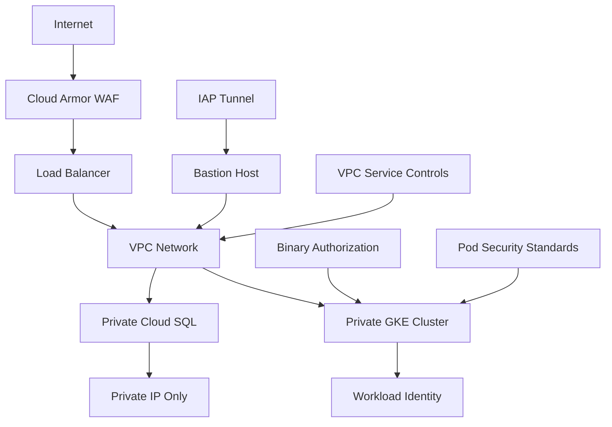

# Security Policy

## Table of Contents

- [Reporting Security Vulnerabilities](#reporting-security-vulnerabilities)
- [Security Best Practices](#security-best-practices)
- [Supported Versions](#supported-versions)
- [Security Architecture](#security-architecture)
- [Compliance and Standards](#compliance-and-standards)
- [Security Testing](#security-testing)
- [Incident Response](#incident-response)

## Reporting Security Vulnerabilities

We take the security of our GCP Terraform modules seriously. If you discover a security vulnerability, please report it responsibly.

### 🚨 How to Report

**DO NOT** create a public GitHub issue for security vulnerabilities.

Instead, please:

1. **Email**: Send details to `security@yourcompany.com`
2. **Subject**: Include "SECURITY VULNERABILITY - GCP Terraform Modules"
3. **Include**:
   - Description of the vulnerability
   - Steps to reproduce the issue
   - Potential impact assessment
   - Suggested remediation (if known)
   - Your contact information

### 🔒 What to Include

Please provide as much information as possible:

```
- Module affected: [terraform-google-gke, terraform-google-cloudsql, etc.]
- Vulnerability type: [Authentication, Authorization, Data exposure, etc.]
- Affected versions: [1.0.0, 1.1.0, etc.]
- Attack vector: [Remote, Local, Physical]
- Impact level: [Critical, High, Medium, Low]
- Proof of concept: [Steps to reproduce]
- Proposed fix: [If available]
```

### ⏰ Response Timeline

We commit to the following response times:

- **Initial acknowledgment**: Within 48 hours
- **Initial assessment**: Within 5 business days
- **Status updates**: Every 10 business days until resolved
- **Resolution**: Varies by complexity and severity

### 🏆 Recognition

We appreciate responsible disclosure and will:

- Credit you in our security advisory (unless you prefer to remain anonymous)
- Keep you informed throughout the investigation process
- Provide updates on fix development and release timeline

## Security Best Practices

### 🛡️ For Contributors

When contributing to this project:

1. **Never commit sensitive data**:
   ```bash
   # Use .gitignore patterns
   *.tfvars
   *.tfstate
   *.tfstate.backup
   .terraform/
   secrets/
   ```

2. **Use secure coding practices**:
   - Follow principle of least privilege
   - Validate all inputs and outputs
   - Use secure defaults
   - Implement proper error handling

3. **Security review checklist**:
   - [ ] No hardcoded credentials or secrets
   - [ ] Proper IAM roles and permissions
   - [ ] Network security controls in place
   - [ ] Encryption at rest and in transit
   - [ ] Audit logging enabled
   - [ ] Resource deletion protection

### 🏗️ For Users

When using these modules:

1. **Secrets Management**:
   ```hcl
   # ❌ Don't do this
   variable "db_password" {
     default = "hardcoded-password"
   }
   
   # ✅ Do this instead
   variable "db_password" {
     description = "Database password - should be provided via environment variable"
     type        = string
     sensitive   = true
   }
   ```

2. **Network Security**:
   ```hcl
   # Enable private clusters
   private_cluster_config {
     enable_private_nodes    = true
     enable_private_endpoint = true
   }
   
   # Restrict authorized networks
   master_authorized_networks_config {
     cidr_blocks {
       cidr_block   = "10.0.0.0/8"  # Corporate network only
       display_name = "corporate-network"
     }
   }
   ```

3. **State File Security**:
   ```hcl
   # Use remote state with encryption
   terraform {
     backend "gcs" {
       bucket  = "terraform-state-bucket"
       prefix  = "terraform/state"
       encryption_key = "your-kms-key"
     }
   }
   ```

## Supported Versions

We provide security updates for the following versions:

| Version | Supported          | End of Life |
| ------- | ------------------ | ----------- |
| 1.2.x   | ✅ Active support  | TBD         |
| 1.1.x   | ✅ Security fixes  | 2025-12-31  |
| 1.0.x   | ⚠️ Critical fixes  | 2025-06-30  |
| < 1.0   | ❌ No support      | 2024-12-31  |

### Version Support Policy

- **Active support**: Regular updates, bug fixes, and security patches
- **Security fixes**: Only critical security vulnerabilities
- **Critical fixes**: Only security issues with CVSS >= 8.0
- **No support**: No updates provided

## Security Architecture

### 🏛️ Defense in Depth

Our modules implement multiple layers of security:



### 🔐 Security Controls by Module

#### terraform-google-svc-projects
- ✅ Project isolation and separation
- ✅ Billing account association
- ✅ API enablement control
- ✅ Resource labeling for governance

#### terraform-google-svpc
- ✅ Private subnets with no external IPs
- ✅ Firewall rules with least privilege
- ✅ VPC Flow Logs for monitoring
- ✅ Private Google Access

#### terraform-google-gke
- ✅ Private cluster with no public IPs
- ✅ Workload Identity for pod authentication
- ✅ Network policies for micro-segmentation
- ✅ Binary Authorization for container security
- ✅ Shielded GKE nodes with secure boot
- ✅ Node auto-repair and auto-upgrade
- ✅ Pod Security Standards enforcement

#### terraform-google-bastion
- ✅ SSH key-based authentication only
- ✅ IAP tunnel for secure access
- ✅ Fail2ban for brute force protection
- ✅ Audit logging of all sessions
- ✅ Network-based access controls

#### terraform-google-cloudsql
- ✅ Private IP configuration only
- ✅ SSL/TLS encryption in transit
- ✅ Encryption at rest
- ✅ Automated backups with retention
- ✅ Point-in-time recovery
- ✅ Authorized networks restriction

#### terraform-google-iam
- ✅ Principle of least privilege
- ✅ Service account key rotation
- ✅ Conditional IAM policies
- ✅ IAM audit logging

#### terraform-google-vpc-sc
- ✅ Data exfiltration protection
- ✅ API access restrictions
- ✅ Service perimeter enforcement
- ✅ Ingress/egress rules

## Compliance and Standards

### 🏅 Compliance Frameworks

Our modules help achieve compliance with:

- **SOC 2 Type II**
- **ISO 27001**
- **PCI DSS** (where applicable)
- **GDPR** (data protection by design)
- **HIPAA** (with additional configuration)

### 📋 Security Standards

We follow these security standards:

- **CIS Google Cloud Platform Foundation Benchmark**
- **NIST Cybersecurity Framework**
- **OWASP Cloud Security Top 10**
- **Google Cloud Security Best Practices**

### 🔍 Security Checklist

Before deploying to production:

- [ ] All default passwords changed
- [ ] Multi-factor authentication enabled
- [ ] Network segmentation implemented
- [ ] Encryption enabled for data at rest and in transit
- [ ] Monitoring and alerting configured
- [ ] Backup and disaster recovery tested
- [ ] Security logging enabled
- [ ] Vulnerability scanning configured
- [ ] Access controls reviewed and documented
- [ ] Incident response plan in place

## Security Testing

### 🧪 Automated Security Testing

We implement the following security tests:

1. **Static Analysis**:
   ```bash
   # Terraform security scanning
   tfsec .
   checkov -f main.tf
   terrascan scan -t terraform
   ```

2. **Infrastructure Testing**:
   ```bash
   # Test security controls
   terratest test/security_test.go
   inspec exec security-baseline
   ```

3. **Compliance Validation**:
   ```bash
   # CIS benchmark validation
   gcloud compute instances list --format="table(name,status,zone,machineType)"
   ```

### 🔒 Security Testing in CI/CD

```yaml
name: Security Scan
on: [push, pull_request]

jobs:
  security:
    runs-on: ubuntu-latest
    steps:
      - uses: actions/checkout@v3
      
      - name: Run tfsec
        uses: aquasecurity/tfsec-sarif-action@v0.1.0
        with:
          sarif_file: tfsec.sarif
          
      - name: Run Checkov
        uses: bridgecrewio/checkov-action@master
        with:
          directory: .
          framework: terraform
          
      - name: Run Terrascan
        uses: accurics/terrascan-action@main
        with:
          iac_type: terraform
```

## Incident Response

### 🚨 Security Incident Response Process

1. **Detection and Analysis** (0-4 hours):
   - Identify and validate the security incident
   - Determine scope and impact
   - Assemble incident response team
   - Begin forensic preservation

2. **Containment and Eradication** (4-24 hours):
   - Implement immediate containment measures
   - Remove threat from environment
   - Apply temporary fixes
   - Document all actions taken

3. **Recovery** (24-72 hours):
   - Restore normal operations
   - Monitor for signs of compromise
   - Implement permanent fixes
   - Update security controls

4. **Post-Incident Activities** (72+ hours):
   - Conduct lessons learned session
   - Update incident response procedures
   - Share findings with stakeholders
   - Implement preventive measures

### 📞 Emergency Contacts

**Security Team**: `security@yourcompany.com`  
**On-Call Engineering**: `oncall@yourcompany.com`  
**Management Escalation**: `security-escalation@yourcompany.com`

### 🔧 Emergency Response Tools

```bash
# Immediate containment commands
gcloud compute instances stop INSTANCE_NAME --zone=ZONE
gcloud container clusters update CLUSTER_NAME --enable-network-policy
gcloud sql instances patch INSTANCE_NAME --no-backup

# Forensic data collection
gcloud logging read 'timestamp>="2024-01-01T00:00:00Z"'
gcloud compute instances get-serial-port-output INSTANCE_NAME
```

## Security Updates and Notifications

### 📢 Security Advisories

Security advisories will be published:

- **GitHub Security Advisories**: For version-specific vulnerabilities
- **Release Notes**: For security-related updates
- **Mailing List**: `security-updates@yourcompany.com` (subscribe for notifications)

### 📅 Security Review Schedule

- **Code Review**: Every pull request
- **Security Audit**: Quarterly
- **Penetration Testing**: Annually
- **Vulnerability Assessment**: Monthly
- **Compliance Review**: Bi-annually

## Contact Information

For security-related questions:

- **General Security**: `security@yourcompany.com`
- **Vulnerability Reports**: `security@yourcompany.com` (PGP key available)
- **Security Questions**: GitHub Discussions with "security" tag

---

**Last Updated**: September 2025  
**Next Review**: December 2025  
**Version**: 1.0